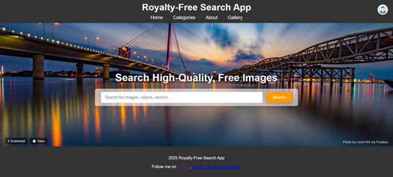
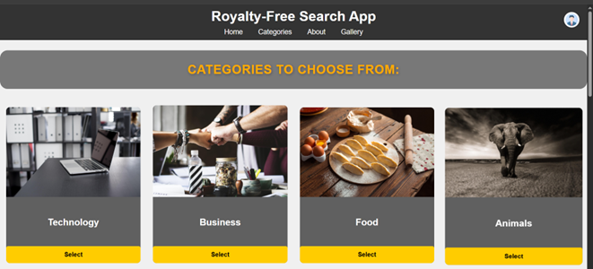
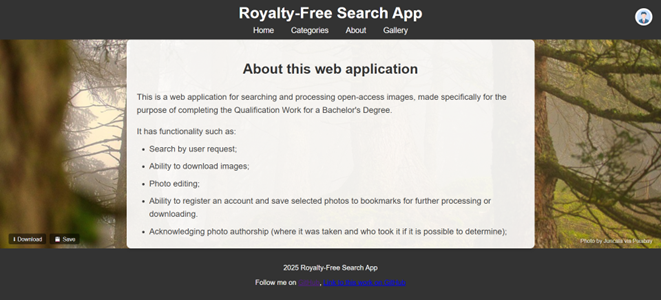
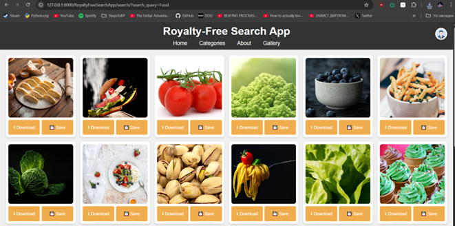
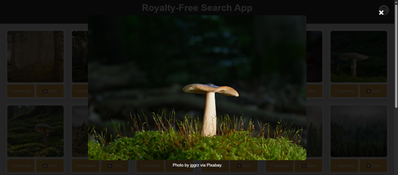
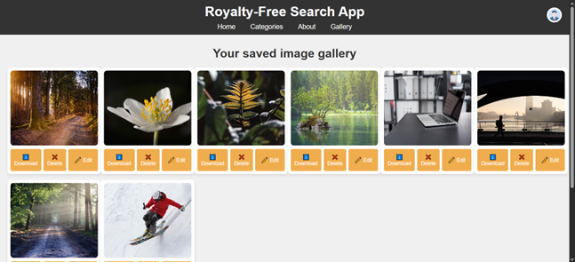
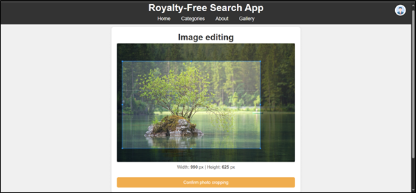
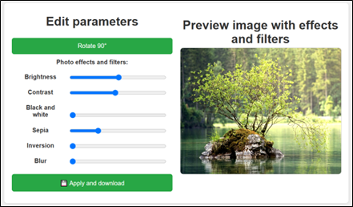

# Royalty-Free Image Search App

🎯 A web application for searching, viewing, and downloading royalty-free images from sources like Freepik, Unsplash, Pexels, and Pixabay(now only this is available). Includes basic editing tools and image gallery features.

## 🌐 Features

- 🔍 Search images by keyword
- 📦 Sources: Freepik API, Pexels API, Unsplash API, Pixabay API
- 🖼️ Download and preview images, save to the gallery and process images
- ✂️ Batch crop and apply filters
- 🖥️ Built with Python, Django, JavaScript, Cropper.js, SQLite

## 📸 Screenshots

## ⚙️ Technologies Used

- Python 3.13.3
- Django
- SQLite
- REST APIs (Freepik, Pexels, Unsplash, Pixabay)
- Requests
- Pillow + Cropper.js for image processing
- Python-dotenv(for loading secret keys from .env)
